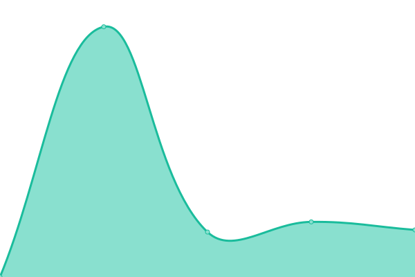

# [📈 Live Status](https://allertafvg.eu.org): <!--live status--> **🟩 All systems operational**

This repository contains the open-source uptime monitor and status page for [Allerta Meteo FVG](https://allertafvg.eu.org), powered by [Upptime](https://github.com/upptime/upptime).

With [Upptime](https://upptime.js.org), you can get your own unlimited and free uptime monitor and status page, powered entirely by a GitHub repository. We use [Issues](https://github.com/allertafvg/status/issues) as incident reports, [Actions](https://github.com/allertafvg/status/actions) as uptime monitors, and [Pages](https://allertafvg.eu.org) for the status page.

<!--start: status pages-->
<!-- This summary is generated by Upptime (https://github.com/upptime/upptime) -->
<!-- Do not edit this manually, your changes will be overwritten -->
<!-- prettier-ignore -->
| URL | Status | History | Response Time | Uptime |
| --- | ------ | ------- | ------------- | ------ |
|  Allerta FVG API 1 | 🟩 Up | [allerta-fvg-api-1.yml](https://github.com/allertafvg/status/commits/HEAD/history/allerta-fvg-api-1.yml) | 

 990ms
     
 | 

<a href="https://status.allertafvg.eu.org/history/allerta-fvg-api-1">100.00%</a>
    

|  Allerta FVG API 2 | 🟩 Up | [allerta-fvg-api-2.yml](https://github.com/allertafvg/status/commits/HEAD/history/allerta-fvg-api-2.yml) | 

 1903ms
     
 | 

<a href="https://status.allertafvg.eu.org/history/allerta-fvg-api-2">100.00%</a>
    

|  Map Server | 🟩 Up | [map-server.yml](https://github.com/allertafvg/status/commits/HEAD/history/map-server.yml) | 

 4393ms
     
 | 

<a href="https://status.allertafvg.eu.org/history/map-server">100.00%</a>
    

|  [Mapbox Tiles Server](https://api.mapbox.com/styles/v1/mapbox/streets-v11/tiles/256/) | 🟩 Up | [mapbox-tiles-server.yml](https://github.com/allertafvg/status/commits/HEAD/history/mapbox-tiles-server.yml) | 

 350ms
     
 | 

<a href="https://status.allertafvg.eu.org/history/mapbox-tiles-server">100.00%</a>
    

<!--end: status pages-->

[**Visit our status website →**](https://allertafvg.eu.org)

## 📄 License

- Powered by: [Upptime](https://github.com/upptime/upptime)
- Code: [MIT](./LICENSE) © [Allerta Meteo FVG](https://allertafvg.eu.org)
- Data in the `./history` directory: [Open Database License](https://opendatacommons.org/licenses/odbl/1-0/)
